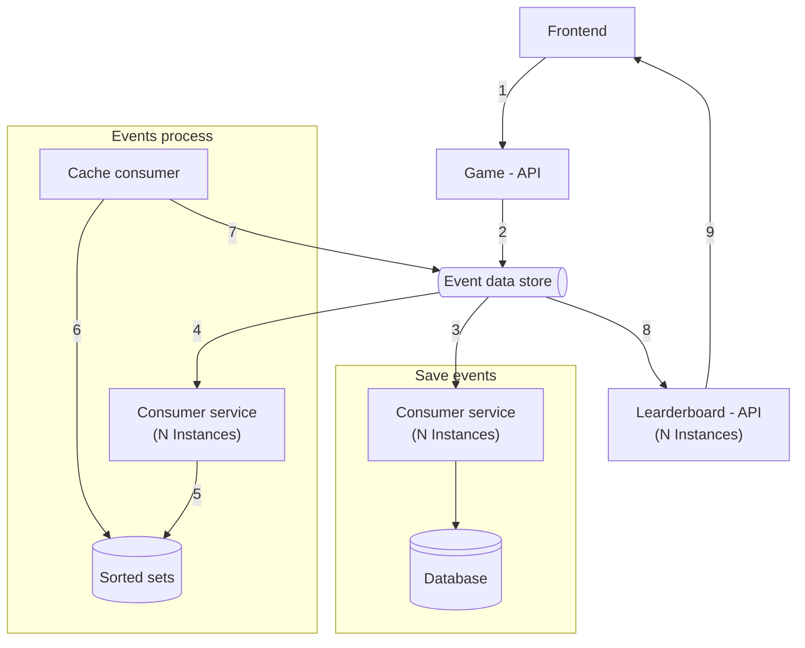

# Real-time Leaderboard

Esse projeto é uma implementação da proposta https://roadmap.sh/projects/realtime-leaderboard-system

```mermaid
graph TD;
	frontend[Frontend]
	api[Game - API]
	events@{ shape: das, label: "Event data store" }
	subgraph Save events
		consumer_1["Consumer service </br> (N Instances)"]
		database@{ shape: lin-cyl, label: "Database" }
	end
	subgraph Events process
		consumer_2["Consumer service </br> (N Instances)"]
		sort@{ shape: cyl, label: "Sorted sets" }
		cache_consumer[Cache consumer]
	end
	learderboard["Learderboard - API </br> (N Instances)"]

	frontend -- 1 --> api
	api -- 2 --> events
	events -- 3 --> consumer_1
	events -- 4 --> consumer_2
	consumer_1 --> database
	consumer_2 -- 5 --> sort
	cache_consumer -- 6 --> sort
	cache_consumer -- 7 --> events
	events -- 8 --> learderboard
	learderboard -- 9 --> frontend
```
